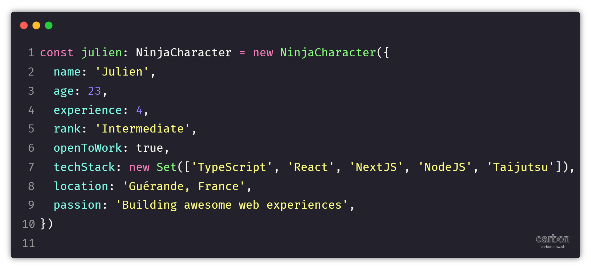

<!-- Titre animé -->
<div align="center">
  
[](https://git.io/typing-svg)

<br/>

<!-- Avatar avec style -->


<br/>

<!-- Badges de compétences avec espacement -->
<p align="center">
  <a href="https://skillicons.dev">
    
  </a>
</p>

<br/>

<!-- Section code avec titre -->
### 👺 **Qui suis-je en code ?**



<br/>

<!-- Scroll indicator stylisé -->
<div align="center">
  
</div>

<br/>

<div align="center" style="margin: 40px 0;">


### 📫 **Connectons-nous !**

<p align="center">
  <a href="mailto:jbigot.dev@gmail.com">
    
  </a>
  <a href="https://www.linkedin.com/in/julien-bigot-903546243/">
    
  </a>
  <a href="https://discordapp.com/users/735922860249448468">
  
</a>
</p>


</div>
<br/>
<br/>
<br/>


</div>

[](https://github.com/ashutosh00710/github-readme-activity-graph)

<div align="center">
<a href="https://github.com/ryo-ma/github-profile-trophy">
  
</a>
</div>


<br/>
<br/>


<div align="center">

# 👋 **Salut, moi c'est `Julien` !**


## 🚀 **Développeur Front-End passionné**

**`4 ans d'expérience ✨`** • **`Design Patterns Enthusiast 📚`** • **`Web Development Ninja 🥷🏻`**


<br/>

> ### 🎯 *"Transforming ideas into elegant code solutions"*

<br/>
<br/>
<br/>

</div>


## ```⚔️ Mes Compétences```

<table>
<tr>
<th><strong>Frontend</strong></th>
<th><strong>Backend</strong></th>
<th><strong>Base de Données</strong></th>
<th><strong>Soft Skills</strong></th>
<th><strong>UI/UX & Design</strong></th>
</tr>
<tr>
<td>HTML5 / CSS3</td>
<td>Node.js</td>
<td>MongoDB</td>
<td>Communication efficace</td>
<td>Figma</td>
</tr>
<tr>
<td>JavaScript (ES6+)</td>
<td>Express.js</td>
<td>Mongoose</td>
<td>Résolution de problèmes</td>
<td>Adobe Creative Suite</td>
</tr>
<tr>
<td>TypeScript</td>
<td>API REST</td>
<td>NoSQL</td>
<td>Autonomie</td>
<td>Wireframing & Prototyping</td>
</tr>
<tr>
<td>React.js / Next.js</td>
<td>Gestion du temps</td>
<td>-</td>
<td>Conception d'interface moderne</td>
<td>-</td>
</tr>
<tr>
<td>Vue.js</td>
<td>JWT Authentication</td>
<td>-</td>
<td>Travail en équipe</td>
<td>Sensibilité au design</td>
</tr>
<tr>
<td>SASS / Tailwind CSS</td>
<td>Microservices</td>
<td>-</td>
<td>Adaptabilité</td>
<td>Design System</td>
</tr>
<tr>
<td>Framer Motion</td>
<td>-</td>
<td>-</td>
<td>Créativité</td>
<td>Responsive Design</td>
</tr>
</table>
<br/>
<table>
<tr>
<th><strong>DevOps & Outils</strong></th>
<th><strong>Méthodologies</strong></th>
<th><strong>SEO & Performance</strong></th>
<th><strong>Concepts Avancés</strong></th>
</tr>
<tr>
<td>Git / GitHub</td>
<td>Agile / Scrum</td>
<td>Optimisation SEO</td>
<td>POO / Design Patterns</td>
</tr>
<tr>
<td>Core Web Vitals</td>
<td>-</td>
<td>-</td>
<td>-</td>
</tr>
<tr>
<td>CI/CD</td>
<td>Code Review</td>
<td>Lighthouse</td>
<td>Clean Code</td>
</tr>
<tr>
<td>Vercel</td>
<td>Méthodologie GitFlow</td>
<td>Optimisation des performances</td>
<td>SOLID Principles</td>
</tr>
<tr>
<td>Documentation</td>
<td>Accessibilité (WCAG)</td>
<td>API Design</td>
<td>-</td>
</tr>
<tr>
<td>ESLint / Prettier</td>
<td>Debugging</td>
<td>Schema.org</td>
<td>Algorithmes</td>
</tr>
<tr>
<td>Webpack / Vite</td>
<td>-</td>
<td>Sécurité Web</td>
<td>-</td>
</tr>
</table>


## ```🎴 Compétences en cours d'apprentissage```
- **Design Pattern** 
- **Advanced Typescript** 
---
